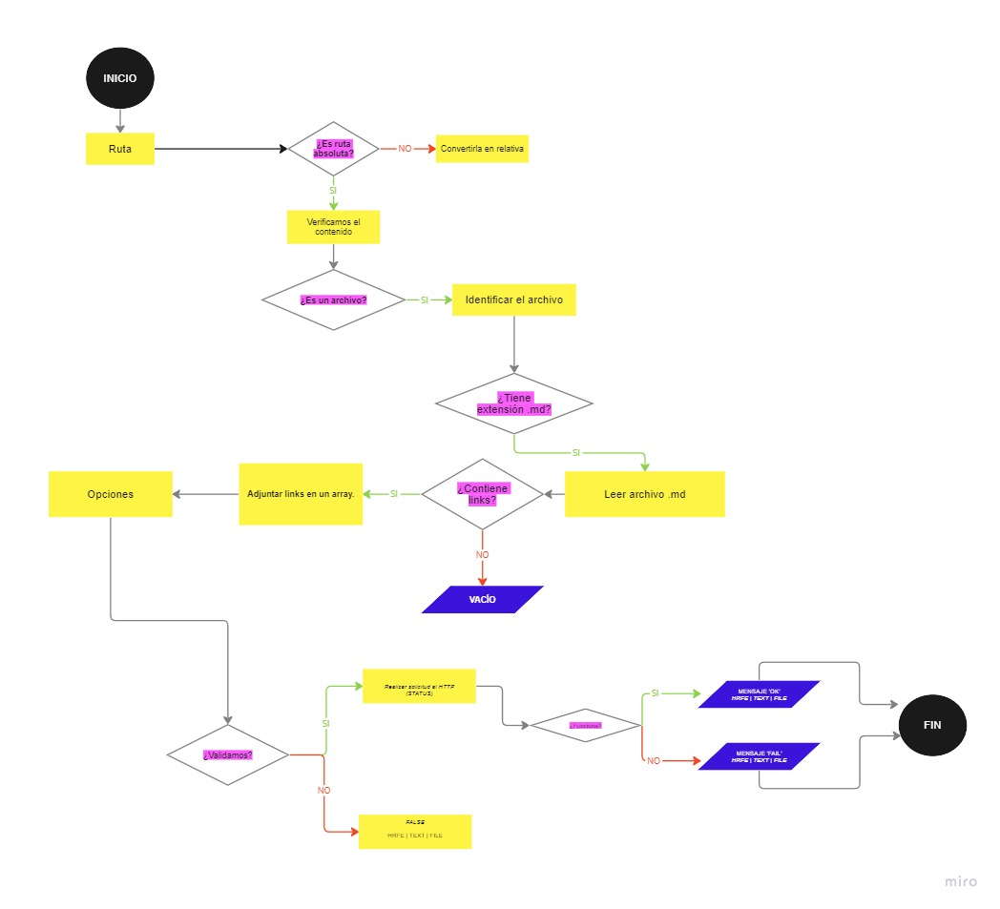

## ⛓️ MARKDOWN LINKS ⛓️

### Introducción 🔍
Este proyecto tuvo la finalidad de crear una librería que pudiera verificar enlaces, pero principalmente identificar si estos links o enlaces están 'rotos'. Usualmente, como developers, usamos el lenguaje ligero llamado Markdown con información importante donde incluyen links/enlaces/vínculos. Por ello, se desarrolló este proyecto con *Node.js* para el 
análisis de archivos, verificación de rutas, identificación de extensiones y las validaciones de los links.

### Diagrama de flujo 📐

### Demostración 🔗
Si cumple con la ruta y se demuestra que el link no está 'roto' => ___'OK :)'___

Si se demuestra que el link está 'roto' => ___'FAIL :('___

